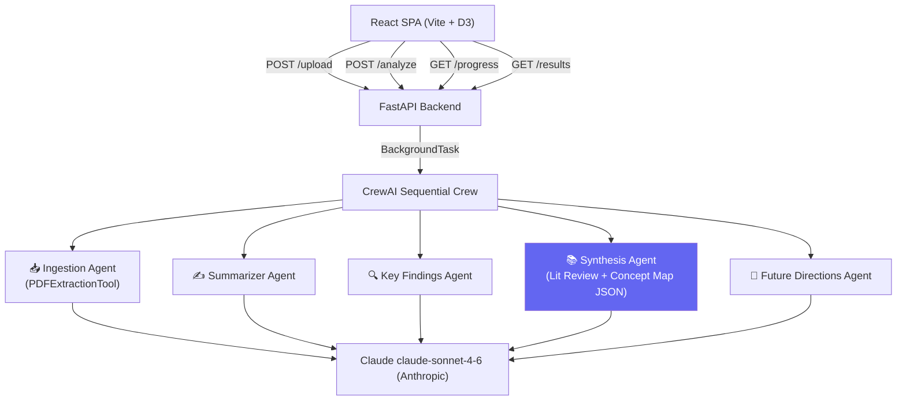

# AI Research Assistant 🧠

A portfolio-quality, multi-agent AI system that analyses 1-3 academic PDF papers and produces:

- **Per-paper summaries** — 150-250 word precision summaries  
- **Structured key findings** — claims, methodology, metrics, and limitations as JSON  
- **Synthesised literature review** — cross-paper analysis (not sequential summaries)  
- **Interactive concept map** — force-directed D3 graph of papers, concepts, and relationships  
- **Future research directions** — 3-5 grounded suggestions with paper citations  

---

## Architecture



### Agent Roles

| Agent | Role | Output |
|---|---|---|
| **Ingestion** | Extracts and structures PDF text, detects sections | Cleaned text + section dict |
| **Summarizer** | 150-250 word per-paper summary | Prose |
| **Key Findings** | Structured findings extraction | JSON list (claim, method, results, limitations) |
| **Synthesis** | Cross-paper lit review + concept map | Prose (400-600 words) + JSON graph |
| **Future Directions** | Evidence-grounded research gap analysis | Formatted bullet list |

Task flow (for 2 papers):
```
Ingest_1 → Summary_1 → Findings_1
Ingest_2 → Summary_2 → Findings_2
                             ↓
                     Synthesis (uses all findings + summaries)
                             ↓
                     Future Directions
```

---

## Setup

### Prerequisites

- Python 3.11+
- Node.js 18+
- Anthropic API key

### 1. Clone and configure environment

```bash
git clone <repo-url>
cd 5daysreaserchassistant
cp .env.example .env
# Edit .env and set ANTHROPIC_API_KEY=your_key_here
```

### 2. Install Python dependencies

```bash
pip install -r requirements.txt
```

### 3. Install frontend dependencies

```bash
cd frontend
npm install
cd ..
```

### 4. Run the backend

```bash
uvicorn backend.main:app --reload --host 0.0.0.0 --port 8000
```

### 5. Run the frontend (separate terminal)

```bash
cd frontend
npm run dev
```

Open **http://localhost:5173** in your browser.

---

## Usage

1. Upload 1-3 academic PDF papers via the drag-and-drop zone
2. Click **Analyse**
3. Watch the 5 agents work (live progress indicator)
4. Explore results across 4 tabs:
   - **Papers** — summaries and structured key findings
   - **Concept Map** — interactive D3 force-directed graph (drag, zoom, click nodes)
   - **Literature Review** — synthesised cross-paper analysis
   - **Future Directions** — research gap suggestions

---

## Sample Papers

Two sample papers are included in `samples/` to make the demo quick to run:

```
samples/
  attention_is_all_you_need.pdf    # Transformer architecture paper
  bert_pretraining.pdf             # BERT language model paper
```

---

## Screenshot

> _Upload 2-3 papers → click Analyse → see the concept map come alive_


---

## API Reference

| Method | Endpoint | Description |
|---|---|---|
| `GET` | `/health` | Health check |
| `POST` | `/upload` | Upload 1-3 PDFs, get `session_id` |
| `POST` | `/analyze` | Start analysis, get `job_id` |
| `GET` | `/progress/{job_id}` | Poll agent progress |
| `GET` | `/results/{job_id}` | Fetch full results JSON |

---

## Project Structure

```
├── backend/
│   ├── main.py              # FastAPI endpoints
│   ├── models.py            # Pydantic schemas
│   ├── crew.py              # ResearchCrew orchestrator
│   ├── agents/
│   │   ├── ingestion_agent.py
│   │   ├── summarizer_agent.py
│   │   ├── findings_agent.py
│   │   ├── synthesis_agent.py
│   │   └── future_agent.py
│   └── tools/
│       └── pdf_tool.py      # Custom CrewAI BaseTool (pdfplumber)
├── frontend/
│   └── src/
│       ├── App.jsx          # State machine + polling
│       ├── api.js           # API client
│       └── components/
│           ├── UploadZone.jsx
│           ├── ProgressTracker.jsx
│           ├── PaperSummary.jsx
│           ├── KeyFindings.jsx
│           ├── LitReview.jsx
│           ├── ConceptMap.jsx   ← D3 force graph
│           └── FutureDirections.jsx
├── samples/                 # Demo PDFs
├── .env.example
├── requirements.txt
└── README.md
```

---

## Future Work

- **PPTX / Slide Generation** — Automatically generate a presentation summarising the analysis results. (Explicitly out of scope for this build.)
- **Background Job Queue** — Celery + Redis for production-grade async job handling, allowing multiple concurrent analyses.
- **Citation Graph** — Parse reference lists and build a citation-relationship graph across papers.
- **RAG Q&A** — Allow users to ask natural language questions about the uploaded papers using retrieval-augmented generation.
- **Export** — Download results as PDF, Markdown, or structured JSON.
