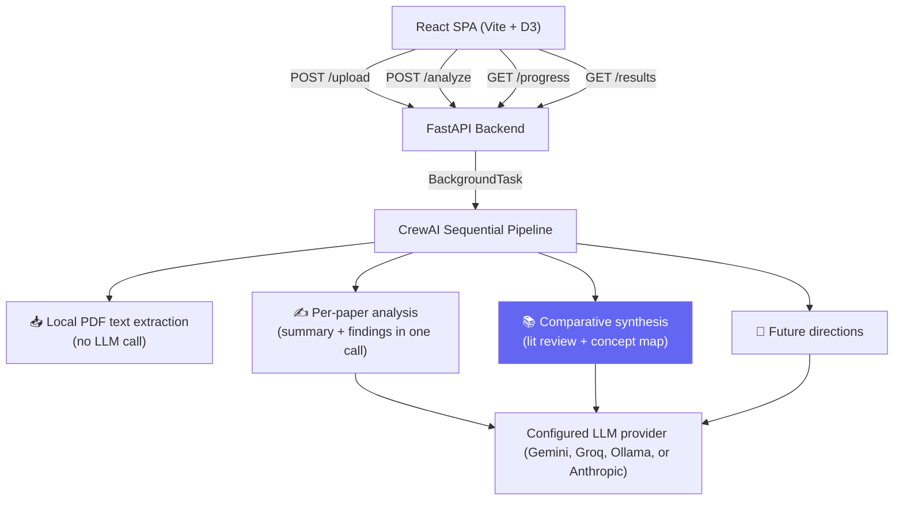

# AI Research Assistant 🧠

A portfolio-quality, multi-agent AI system that analyses 1-3 academic PDF papers and produces:

- **Per-paper summaries** — 150-200 word precision summaries
- **Structured key findings** — claims, methodology, metrics, and limitations as JSON  
- **Synthesised literature review** — cross-paper analysis (not sequential summaries)  
- **Interactive concept map** — force-directed D3 graph of papers, concepts, and relationships  
- **Future research directions** — three grounded study proposals with paper citations

---

## Architecture



### Agent Roles

| Agent | Role | Output |
|---|---|---|
| **PDF extraction** | Extracts text and detects sections locally | Source text + section metadata |
| **Paper analysis** | Summarizes and extracts findings in one LLM call per paper | Summary + structured findings JSON |
| **Comparative synthesis** | Compares findings and methods across papers | Literature review + concept map JSON |
| **Future directions** | Proposes research questions and study designs grounded in evidence | Three structured proposals |

Task flow (for 2 papers):
```
Extract PDFs locally
       ↓
Paper analysis 1 → Paper analysis 2
       ↓
Comparative synthesis → Future directions
```

The pipeline makes `number of papers + 2` LLM calls rather than separate
ingestion, summary, and findings calls for every paper. PDF extraction is local.

---

## Setup

### Prerequisites

- Python 3.11+
- Node.js 18+
- An API key for Google Gemini, Groq, or Anthropic (or a local Ollama installation)

### 1. Clone and configure environment

```bash
git clone <repo-url>
cd 5daysreaserchassistant
cp .env.example .env
# Edit .env and set GEMINI_API_KEY=your_key_here
```

### 2. Install Python dependencies

```bash
pip install -r requirements.txt
```

### 3. Install frontend dependencies

```bash
cd frontend
npm install
cd ..
```

### 4. Run the backend

```bash
uvicorn backend.main:app --reload --host 0.0.0.0 --port 8001
```

### 5. Run the frontend (separate terminal)

```bash
cd frontend
npm run dev
```

Open **http://localhost:5173** in your browser.

Gemini is preferred when both Gemini and Groq keys are configured because free Groq
quotas can limit output tokens per minute. To explicitly use Groq, set
`LLM_MODEL=groq/qwen/qwen3.8-27b`; if its quota is exhausted, wait for the provider's
reset window or use a provider with a higher available quota. Gemini defaults to
`gemini/gemini-3.8-flash`; set `LLM_MODEL=gemini/<model-id>` to choose another
Gemini API model. To use a locally running Ollama model instead, set
`LLM_MODEL=ollama/<model-name>` (for example, `ollama/llama3.2:3b`) and ensure
Ollama is installed and the model has been downloaded with `ollama pull`.

---

## Usage

1. Upload 1-3 academic PDF papers via the drag-and-drop zone
2. Click **Analyse**
3. Watch the 5 agents work (live progress indicator)
4. Explore results across 4 tabs:
   - **Papers** — summaries and structured key findings
   - **Concept Map** — interactive D3 force-directed graph (drag, zoom, click nodes)
   - **Literature Review** — evidence-cited comparisons of findings, methods, limitations, and research gaps
   - **Future Directions** — three evidence-grounded study proposals, each with a question, gap, design, and evaluation plan

---

## Sample Papers

Two sample papers are included in `samples/` to make the demo quick to run:

```
samples/
  attention_is_all_you_need.pdf    # Transformer architecture paper
  bert_pretraining.pdf             # BERT language model paper
```

---

## Screenshot

> _Upload 2-3 papers → click Analyse → see the concept map come alive_


---

## API Reference

| Method | Endpoint | Description |
|---|---|---|
| `GET` | `/health` | Health check |
| `POST` | `/upload` | Upload 1-3 PDFs, get `session_id` |
| `POST` | `/analyze` | Start analysis, get `job_id` |
| `GET` | `/progress/{job_id}` | Poll agent progress |
| `GET` | `/results/{job_id}` | Fetch full results JSON |

---

## Project Structure

```
├── backend/
│   ├── main.py              # FastAPI endpoints
│   ├── models.py            # Pydantic schemas
│   ├── crew.py              # ResearchCrew orchestrator
│   ├── agents/
│   │   ├── ingestion_agent.py
│   │   ├── summarizer_agent.py
│   │   ├── findings_agent.py
│   │   ├── synthesis_agent.py
│   │   └── future_agent.py
│   └── tools/
│       └── pdf_tool.py      # Custom CrewAI BaseTool (pdfplumber)
├── frontend/
│   └── src/
│       ├── App.jsx          # State machine + polling
│       ├── api.js           # API client
│       └── components/
│           ├── UploadZone.jsx
│           ├── ProgressTracker.jsx
│           ├── PaperSummary.jsx
│           ├── KeyFindings.jsx
│           ├── LitReview.jsx
│           ├── ConceptMap.jsx   ← D3 force graph
│           └── FutureDirections.jsx
├── samples/                 # Demo PDFs
├── .env.example
├── requirements.txt
└── README.md
```

---

## Future Work

- **PPTX / Slide Generation** — Automatically generate a presentation summarising the analysis results. (Explicitly out of scope for this build.)
- **Background Job Queue** — Celery + Redis for production-grade async job handling, allowing multiple concurrent analyses.
- **Citation Graph** — Parse reference lists and build a citation-relationship graph across papers.
- **RAG Q&A** — Allow users to ask natural language questions about the uploaded papers using retrieval-augmented generation.
- **Export** — Download results as PDF, Markdown, or structured JSON.
